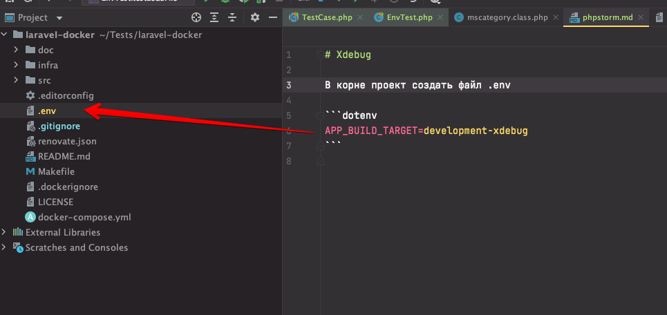

# Xdebug

Сперва настроить phpunit и инструкции **phpunit.md**

# Создать файл env

В корне проект создать файл **.env**

```dotenv
APP_BUILD_TARGET=development-xdebug
```



# Выполнить
```bash
make install 
```
